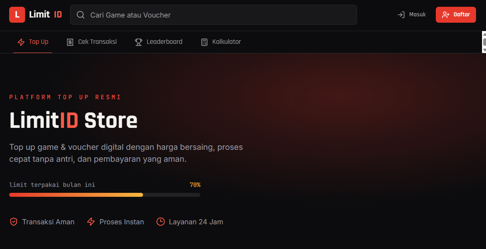
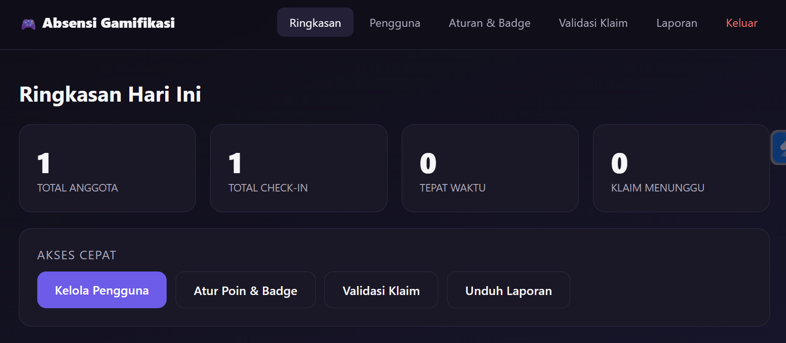

# 👋 Hi, I'm Moh Nurul Iman

### 🎓 Information Systems Student | 💻 Web Developer | 🎮 Gamer

<p align="center">
  
</p>

<p align="center">
  
</p>

---

## 🌙 About Me

```yaml
Name: Moh Nurul Iman
Education: Information Systems Student
Role: Web Developer
Location: Indonesia

Interests:
  - Web Development
  - Database
  - UI/UX Design
  - Technology
  - Gaming

Currently Learning:
  - Laravel
  - Livewire
  - MySQL
```

---

## 🛠️ Tech Stack

### 💻 Programming & Framework

<p align="left">
  
</p>

### 🗄️ Database & Dev Tools

<p align="left">
  
</p>

### 🌈 Design & UI/UX

<p align="left">
  
</p>

---


## 🚀 Featured Projects

<table>
<tr>

<td width="50%" valign="top">

<p align="center">
  
</p>

<h3>🎮 LimitID Store</h3>

<p>
Website top up game untuk melakukan pembelian berbagai kebutuhan game secara online.
</p>

<p>
<b>Tech Stack:</b><br>
TypeScript • MySQL • HTML • CSS • JavaScript
</p>

<p>
<a href="https://github.com/imans7/absensi-gamifikasi.git">
  
</a>
</p>

</td>

</tr>
</table>
<table>
<tr>

<td width="50%" valign="top">

<p align="center">
  
</p>

<h3>📊absensi-app</h3>

<p>
Sistem Absensi dan Aktivitas Mahasiswa Berbasis Gamifikasi.
</p>

<p>
<b>Tech Stack:</b><br>
HTML • CSS • JavaScript
</p>

<p>
<a href="https://github.com/imans7/absensi-gamifikasi">
  
</a>
</p>

</td>

</tr>
</table>

---

## 📊 GitHub Statistics

<p align="center">
  
  
</p>
---

## 🔥 GitHub Streak

<p align="center">
  
</p>

---

## 🐍 My Contributions

<p align="center">
  <picture>
    <source media="(prefers-color-scheme: dark)" srcset="https://raw.githubusercontent.com/imans7/imans7/output/github-snake-dark.svg" />
    <source media="(prefers-color-scheme: light)" srcset="https://raw.githubusercontent.com/imans7/imans7/output/github-snake.svg" />
    
  </picture>
</p>

---

## 🌱 Currently Learning

```text
Laravel       ███████████████░░░  60%
Livewire      ████████████░░░░░░  65%
MySQL         ███████████████░░░  80%
JavaScript    ████████████░░░░░░  65%
UI/UX         ██████████░░░░░░░░  55%
```

---

## 🎯 2026 Goals

* [ ] 🚀 Build more Laravel projects
* [ ] ⚡ Master Livewire
* [ ] 🗄️ Improve database design skills
* [ ] 🎨 Improve UI/UX skills
* [ ] 📱 Build a Flutter application
* [ ] 💼 Build a stronger developer portfolio
* [ ] 🌎 Contribute to open-source projects

---

## 💡 Random Dev Quote

<p align="center">
  
</p>

---

## 📫 Let's Connect

<p align="center">

<a href="https://github.com/imans7">
  
</a>

<a href="mailto:iman.gmoff@gmail.com">
  
</a>

<a href="https://discord.gg/FukQxXvX">
  
</a>
</p>

---

<p align="center">

### ✨ "Code. Learn. Build. Repeat." ✨

**Thanks for visiting my profile! 👋**

</p>

<p align="center">
  
</p>
